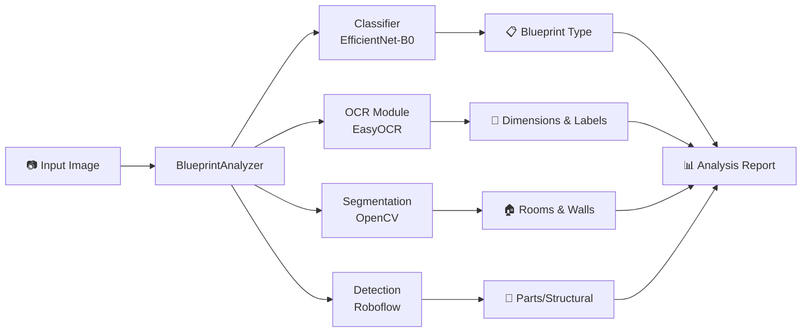

# 🏗️ Blueprint Analysis System

[](https://python.org)
[](https://pytorch.org)
[](https://roboflow.com)

A complete **computer vision pipeline** for analyzing architectural blueprints. Automatically classifies blueprint types, extracts text/dimensions, and detects rooms & structural elements using a combination of deep learning and heuristic computer vision.

## ✨ Features

| Feature | Description | Technology |
| :--- | :--- | :--- |
| **🔍 Classification** | Identify blueprint types (floor plan, elevation, section, site plan) | EfficientNet-B0 |
| **🎯 AI Detection** | Detect structural elements (doors, windows, columns) | Roboflow (YOLO) |
| **📝 OCR** | Extract dimensions, room labels, and annotations | EasyOCR |
| **🏠 Segmentation** | Detect rooms and wall structures | OpenCV |
| **🎨 Demo Interface** | Interactive web UI for analysis | Gradio |

---

## 🏛️ Architecture



---

## 🚀 Quick Start (Demo)

### 📊 Project Demo

Run the interactive Gradio dashboard:

```bash
python demo_app.py
```

### 🧠 Roboflow Integration

The detection module integrates with Roboflow for object detection. To use your own API key, set the `ROBOFLOW_API_KEY` environment variable.

---

## 📁 Project Structure

```text
blueprint_analysis/
├── blueprint_analyzer.py   # 🔧 Main analysis pipeline
├── classifier.py           # 🧠 EfficientNet-B0 classifier
├── ocr_module.py           # 📝 Text extraction (EasyOCR)
├── segmentation.py         # 🏠 Room/wall detection (OpenCV)
├── detection.py            # 🎯 AI Element Detection (Roboflow)
├── demo_app.py             # 🎯 Gradio demo interface
└── requirements.txt        # 📦 Dependencies
```

---

## 📖 Usage

```python
from blueprint_analyzer import BlueprintAnalyzer

# Initialize with trained model
analyzer = BlueprintAnalyzer(model_path="blueprint_classifier.pth")

# Analyze a blueprint image
results = analyzer.analyze("floor_plan.jpg", include_visualization=True)

# Generate text report
report = analyzer.generate_report(results)
print(report)
```

---

## 🧪 Evaluation

| Blueprint Type | Accuracy |
| :--- | :--- |
| Floor Plan | 100% |
| Elevation | 100% |
| Section | 100% |
| Site Plan | 100% |

*Trained on synthetic data for demonstration.*

---

## 📄 License

MIT License. Built for HeadstormAI Computer Vision Engineer Portfolio.
