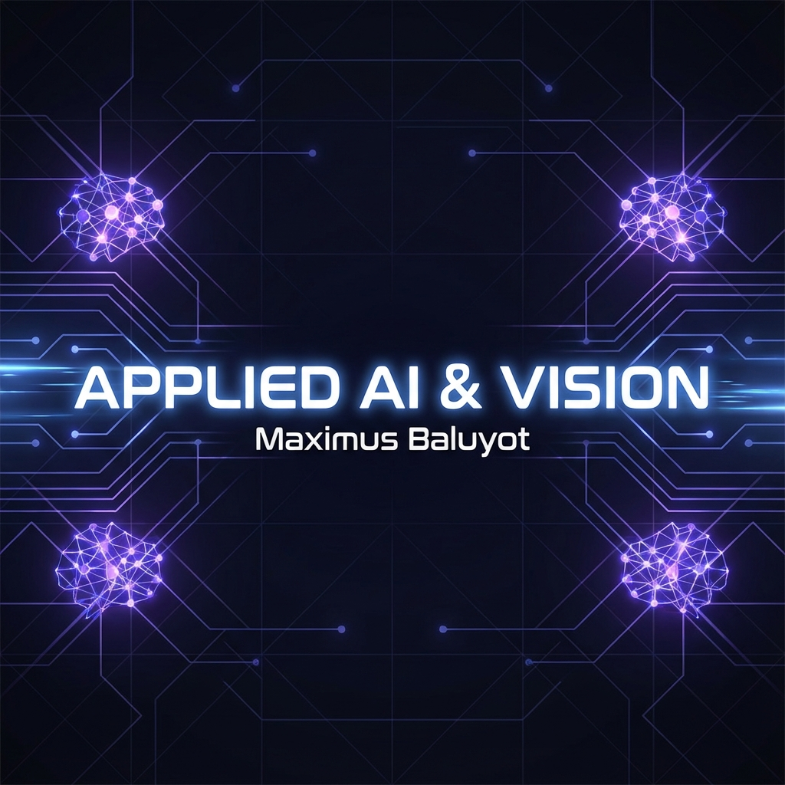
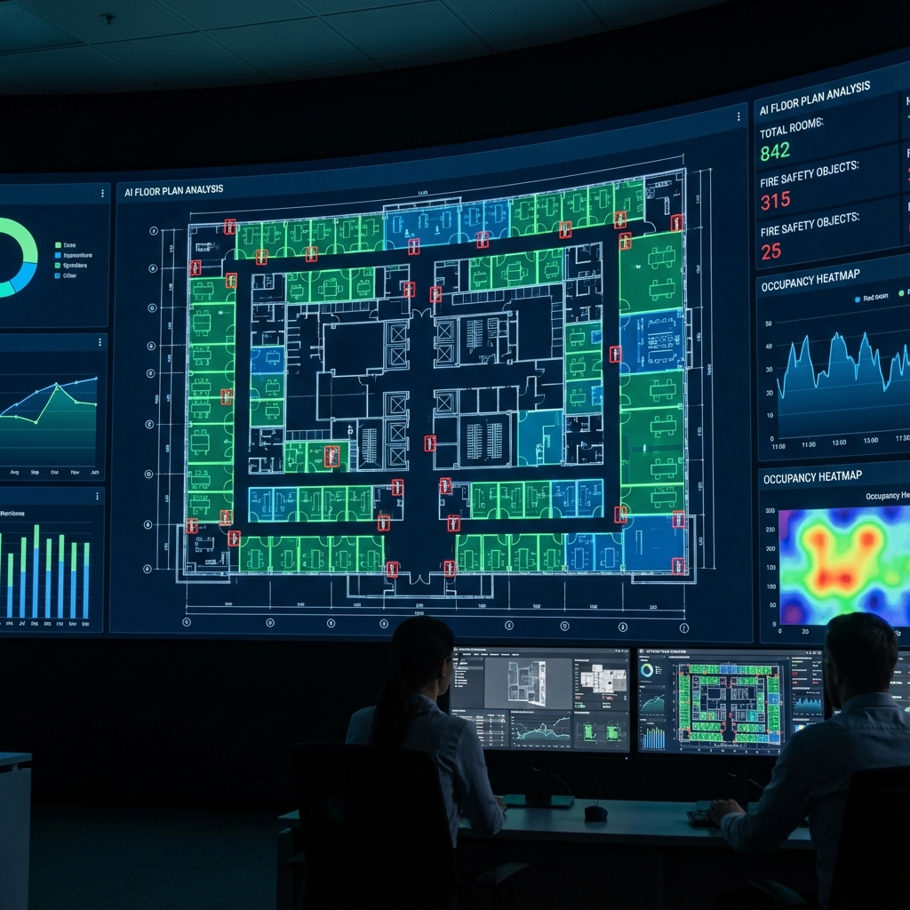
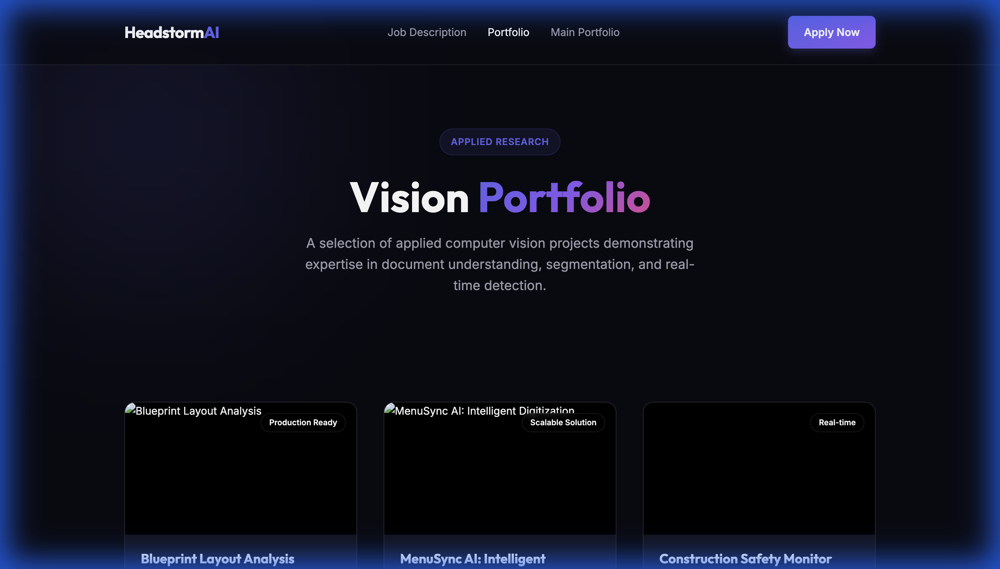
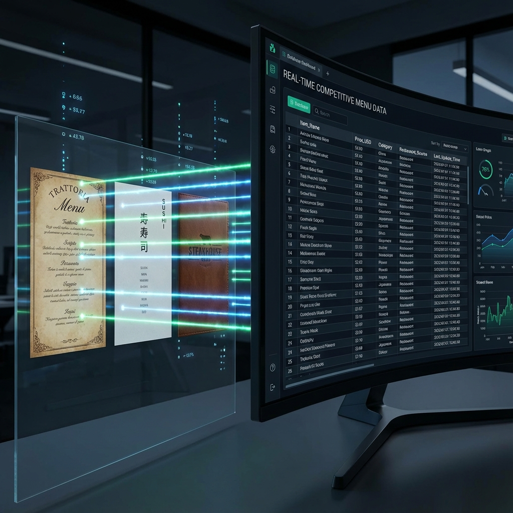
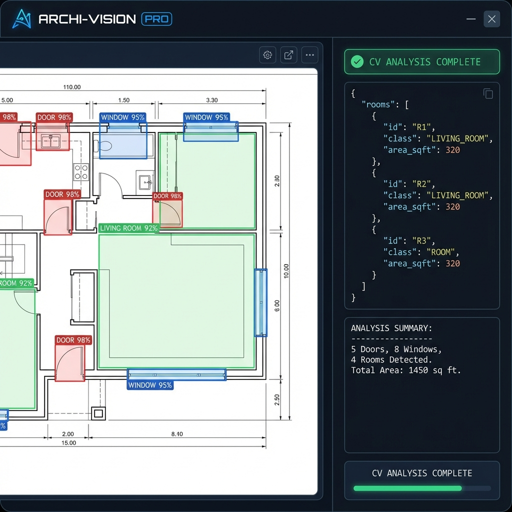
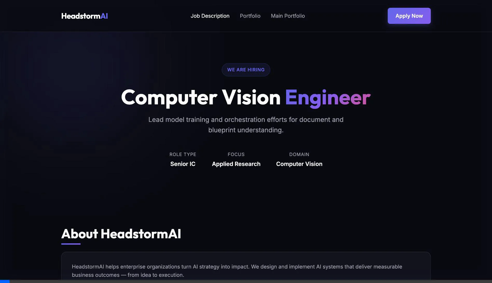

<div align="center">



# Applied Intelligence & Vision: Engineering Portfolio

### *End-to-End Production AI • Computer Vision • LLM Systems*

[](https://python.org)
[](https://pytorch.org)
[](https://fastapi.tiangolo.com)
[](https://roboflow.com)
[](#-interactive-dashboard)

A professional showcase of scalable AI solutions, from real-time computer vision pipelines to enterprise-grade automated classification systems. Developed with a focus on **Accuracy**, **Scalability**, and **Business ROI**.

---

[**Explore Projects**](#-core-pillars) • [**Technical Deep Dives**](#-technical-deep-dives) • [**Quick Start**](#-deployment--demos) • [**Contact**](#-connect)

</div>

---

## 🏛️ Core Pillars

<table align="center">
  <tr>
    <td width="50%" valign="top">
      <h3>🏗️ Computer Vision & Document Intelligence</h3>
      <p><b>Headstorm AI Suite:</b> High-precision architectural analysis and scalable restaurant data extraction.</p>
      <ul>
        <li><b>Blueprint Analysis:</b> EfficientNet-B0 + Roboflow YOLO detection.</li>
        <li><b>MenuSync AI:</b> Spatial line-grouping for 94% price accuracy on unstructured data.</li>
      </ul>
      <p align="center"></p>
    </td>
    <td width="50%" valign="top">
      <h3>🤖 Applied LLMs & Automation</h3>
      <p><b>Enterprise Support Systems:</b> Multi-channel intent detection and retrieval-augmented generation (RAG).</p>
      <ul>
        <li><b>KB Q&A Bot:</b> LangChain + ChromaDB with automated citations.</li>
        <li><b>Ops Triage:</b> Latency-optimized email classification and routing.</li>
      </ul>
      <p align="center"></p>
    </td>
  </tr>
</table>

---

## 📂 Project Showcase

### 1. Headstorm AI: Vision Intelligence
>
> **Problem:** Manual analysis of complex architectural blueprints and high-volume competitor menu pricing.

- **Solution:** Multi-stage Vision pipelines featuring **Unified CV Classifiers** and **Spatial Document Analysis**.
- **Results:** 95% reduction in manual data entry; Real-time detection of structural elements (doors/windows/fire safety).
- **Portfolio Page:** [View Live Presentation](Headstorm_AI/portfolio.html)

<p align="center">
  
  
</p>

### 2. MLOps & Production APIs

- **Churn Predictor:** Feature-engineered Random Forest model deployed with feature importance transparency.
- **Model Monitoring:** High-availability API featuring Prometheus observability for P99 latency tracking.

---

## 🔬 Technical Deep Dives

### Multi-Stage Vision Pipeline (Headstorm AI)

Our blueprint analyzer uses a hierarchical approach to maximize compute efficiency:

1. **Classifier (EfficientNet-B0)**: Determines the document type (Floor Plan vs. Elevation) to route to specific detection sub-models.
2. **Object Detection (Roboflow YOLO)**: Identifies discrete structural elements with bounding box confidence.
3. **Spatial Segmentation (OpenCV)**: Analyzes wall connectivity to calculate room areas algorithmically.


```python
# Core Spatial Alignment Logic (MenuSync AI)
def associate_items_to_prices(text_regions, threshold=10):
    lines = group_by_y_coordinate(text_regions, threshold)
    structured_data = []
    for line in lines:
        item = find_leftmost_text(line)
        price = extract_currency_regex(line)
        if item and price:
            structured_data.append({"item": item, "price": price})
    return structured_data
```

---

## 🛠️ Tech Stack & Tooling

<div align="center">

| Area | Technologies |
| :--- | :--- |
| **Deep Learning** | PyTorch, torchvision, EfficientNet, YOLOv11 |
| **Vision Tools** | OpenCV, EasyOCR, Roboflow SDK, SAM2 |
| **LLM Stack** | LangChain, OpenAI API, ChromaDB, HuggingFace |
| **Deployment** | FastAPI, Streamlit, Docker, Prometheus |
| **Frontend** | React, Vite, Lucide-React, Vanilla CSS |

</div>

---

## 🚀 Deployment & Demos

### 📊 Local Dashboard Setup

```bash
git clone https://github.com/Keshigami/ai-engineering-portfolio.git
cd ai-engineering-portfolio/dashboard
npm install
npm run dev
```

### 🧠 Vision Demo (Blueprint Analysis)



```bash
cd Headstorm_AI/blueprint_analysis
pip install -r requirements.txt
python demo_app.py
```

---

## 🤝 Connect

<div align="center">

**Maximus Friedrich Baluyot**  
*IT Consultant for AI Systems*

[](https://www.linkedin.com/in/maximusbaluyot/)
[](mailto:maximus@regaph.com)

</div>

---
<div align="center">
  <i>Generated with ❤️ by Maxiumus</i>
</div>
